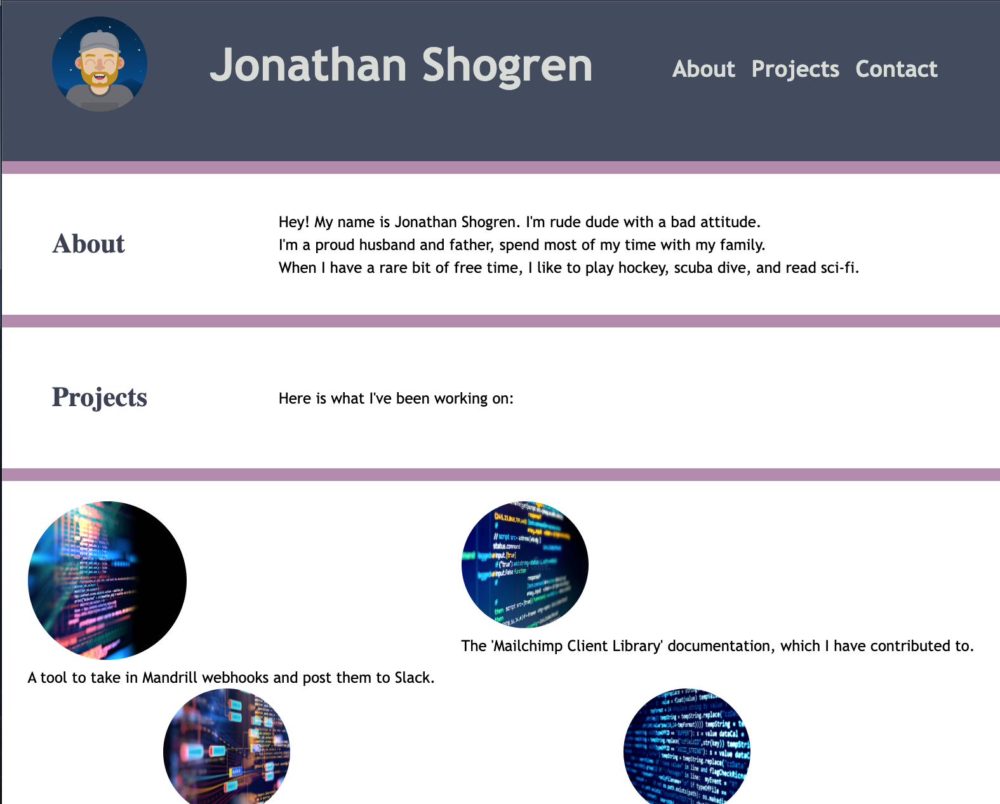

# 02-Advanced-CSS-Portfolio

## Description

This is the module 02 "Professional Portfolio" by Jonathan Shogren. The challange was to create a portfolio site that showcases the work that I've been doing.

Here is a link to the live finished page: https://shogren.github.io/02-Advanced-CSS-Portfolio/

## User Story

> AS an employer
>
> I WANT to view a potential employee's deployed portfolio of work samples
>
> SO THAT I can review samples of their work and assess whether they're a good candidate for an open position

## Screenshot

Here is a screenshot of the finished site:

## Additional Notes

* I'm happy with the way the page wraps when resized, it took a lot of experimenting to get it right.

* The way the project images look was not on purpose, but once I "fixed" it I realized I liked it better when they look like planets.

* There is functionality that I toyed around with adding, but it was taking too long. This meets the acceptance criteria: Done is done!
